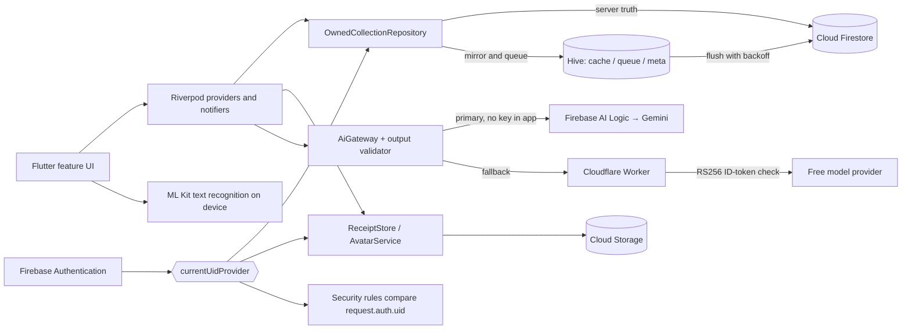

<p align="center">
  
</p>
<h1 align="center">FinGenius AI</h1>
<p align="center">
  An explainability-first personal finance and financial-wellness companion for Android.
</p>
<p align="center">
  
  
  
  
  
</p>

FinGenius AI brings expense capture, budgeting, cash-flow forecasting, and an AI assistant into one offline-first Flutter application. It is the financial-wellness instantiation of the "AI-Driven Smart Lifestyle Companion" brief for CMP 7003. Its contribution is architectural rather than algorithmic: every intelligent output carries its own provenance, confidence and uncertainty, and the generative layer is constrained so the system degrades rather than fails.

> [!IMPORTANT]
> Every automated result is advisory and correctable. Categories carry the layer and confidence that produced them; forecasts publish an uncertainty band and a visible backtest rather than a single confident figure; scanned receipts and detected subscriptions are proposals until you confirm them. The financial-health score is explicitly **not** a credit score.

## Highlights

| Area | What is implemented |
| --- | --- |
| Dashboard | Net worth, month-to-date income and expenses, a financial-health score decomposed into five named factors with weights and improvement hints, savings-goal progress, upcoming bills, and a one-tap control that hides every monetary value in the app |
| Expense capture | Two first-class routes — on-device receipt scanning and a short manual form — sharing one set of validators, a double-submit guard, and identical downstream handling |
| Receipt OCR | Google ML Kit Text Recognition v2 entirely on device: printed lines reassembled by vertical overlap, money tokens ranked so an explicit total outranks a subtotal, and a fingerprint that detects a receipt already scanned |
| Categorisation | Four layers — user rules (0.98), learned corrections (0.90), a keyword map seeded with Sri Lankan merchants (0.70), fallback (0.10) — each result carrying its category, confidence and source; corrections are remembered per merchant |
| Forecasting | Holt's linear exponential smoothing over monthly totals with an approximately 80 % interval derived from historical one-step error, plus a backtest panel showing what past forecasts predicted against what happened |
| AI assistant | Gemini through Firebase AI Logic with no model key in the app, aggregates-only prompts, application-side output validation, a daily quota consumed only on success, voice input, and a verified proxy fallback |
| Planning | Category budgets with one-shot alerts at 80 % and 100 %, savings goals with contributions and projections, a bill calendar that expands recurrences by month, and subscription candidates surfaced after three regular payments |
| Reports | Income against expenses, a table equivalent of the primary chart, category breakdown, cash-flow forecast, and budget versus actual |
| Offline-first sync | Hive mirror for instant reads, a durable pending queue with UUID-keyed idempotent merge-sets and deletes, exponential backoff, and last-write-wins on a server timestamp with deletes taking precedence |
| Security and privacy | Default-deny Firestore and Storage rules with owner scoping and field validation, build-gated `FLAG_SECURE`, biometric app lock, encrypted local preferences, seven permissions and no location, and consent-gated telemetry |
| Accounts | Email/password authentication with email verification, profile photo upload, granular privacy consent, data export, and account deletion requiring re-authentication |

## Design principles

The architecture answers four deficits found in the reviewed literature on intelligent personal-finance software:

- **Provenance over accuracy alone.** A classification that cannot be inspected or corrected is not trustworthy, so every category carries the layer and confidence that produced it, and every correction is learned.
- **Uncertainty is published, not hidden.** A point forecast presented without its error invites reliance it cannot support, so the interval and the backtest are shown together.
- **Guardrails live in the application.** Provider-side safety filters can be bypassed, so generative output is validated locally before it reaches the screen.
- **Context is minimised, not maximised.** Prompts carry aggregated figures only — never merchants, notes or individual transactions — and text recognition never leaves the device.

## Architecture



Everything a signed-in user owns lives beneath `users/{uid}`, and every path in both Firestore and Storage is built from a single reactive source. Sign out and every dependent provider is invalidated automatically, so one account's data cannot be read while another is signed in.

```text
lib/
├── app/
│   ├── config/             # session providers, App Check flag, AI build-time config
│   ├── routing/            # GoRouter, StatefulShellRoute, redirect guard
│   └── theme/              # semantic design tokens and Material 3 theme
├── core/
│   ├── data/               # OwnedCollectionRepository, PendingQueue
│   ├── storage/            # per-user Hive boxes
│   ├── security/           # secure-screen channel wrapper, app lock
│   ├── errors/ utils/      # Result and Failure types, Money, Dates, Validators
│   └── networking/ widgets/ analytics/ notifications/ diagnostics/
├── features/               # 16 modules, each split data / domain / presentation
└── main.dart               # guarded bootstrap
android/                    # single host Activity, manifest, Gradle, secure-screen channel
assets/brand/               # vector brand system
docs/                       # engineering and academic documentation
rules_test/                 # Firestore and Storage rules suites (Node + emulators)
appium-tests/               # WebdriverIO + Appium end-to-end suite
test/                       # 262 unit and widget cases across 31 files
tool/                       # brand asset render pipeline
```

### Mobile layers

- **Presentation** — Material 3 widgets driven by one semantic token file; `go_router` with a top-level redirect guard enforcing sign-in, email verification and app lock before any protected route resolves.
- **Application** — Riverpod notifiers coordinate streams, forms and commands. `currentUidProvider` derives the signed-in identifier from the auth stream and is watched by every repository and service.
- **Domain** — deterministic logic with no Firebase import, which is why it is unit-testable without an emulator: the categoriser, Holt forecaster, health score, subscription detector, duplicate fingerprinting, bill recurrence and money arithmetic.
- **Data** — `OwnedCollectionRepository` is generic over entity type and serialisation functions. No widget touches Firestore directly.

### The offline write path

1. The notifier calls `upsert()`; the entity is written to the Hive mirror, so the row appears immediately.
2. An operation carrying a UUID is appended to `PendingQueue`.
3. The queue flushes to Firestore with exponential backoff.

Because each operation applies as a merge-set or delete keyed by document identifier, replaying it produces the same result — a flush that fails halfway and is retried cannot create duplicate records. Reads run the other way: a snapshot stream delivers server state, the repository merges it with anything still queued, and the widget rebuilds.

### AI request path

1. The app assembles a bounded snapshot — monthly totals, per-category sums, counts and the health score. Merchants, notes, account names and individual transactions are never included.
2. `AiGateway` calls Gemini through **Firebase AI Logic**, so no model API key exists anywhere in the application and the request is attested by Firebase Authentication.
3. The reply passes an output validator before display: prose promising guaranteed returns or issuing direct trade instructions is rejected, and structured responses are schema-validated.
4. On failure the prompt is retried once through a Cloudflare Worker that verifies the caller's Firebase ID token by RS256 signature — checking issuer, audience and expiry — before forwarding to a free provider whose key is held server-side.
5. The daily quota is consumed only on success.

## Technology stack

- Flutter and Dart with Riverpod for state and `go_router` for guarded navigation
- Firebase Authentication, Cloud Firestore, Cloud Storage, Messaging, Analytics, Crashlytics, Remote Config and App Check
- **Firebase AI Logic** for Gemini, so no model key ships in the binary
- Google ML Kit Text Recognition v2 for on-device receipt OCR
- `hive_ce` for the offline mirror and durable operation queue
- `local_auth` with `FlutterFragmentActivity` for the biometric app lock
- `fl_chart` for reports, `speech_to_text` for voice entry, `image_cropper` for profile photos
- A Cloudflare Worker as the optional, authenticated AI fallback proxy

## Prerequisites

- Flutter stable satisfying Dart `^3.5.0`
- Android Studio and the Android SDK
  - compile SDK 35, minimum SDK 24, target SDK 35
  - JDK 17
- A Firebase project on the Blaze plan (Cloud Storage and AI Logic are unavailable on Spark)
- Firebase CLI and Node 20+ for the security-rules suite
- Node 20+, Appium and a physical Android device for the end-to-end suite
- Optionally, a Cloudflare account if you want the AI fallback proxy

## Getting started

### 1. Clone and install

```bash
git clone <repository-url> fingenius_ai
cd fingenius_ai

# Version pins were resolved without pub.dev access — refresh them on first run
flutter pub upgrade --major-versions
flutter pub get
```

Install Node dependencies for the test suites you plan to run:

```bash
cd rules_test   && npm install && cd ..
cd appium-tests && npm install && cd ..
```

### 2. Configure Firebase

Register an Android app using the current application identifier:

- Android application ID: `com.msc.fingenius`

Download the configuration file and place it at:

```text
android/app/google-services.json
```

That path is ignored by Git. The project deliberately does **not** use a generated `firebase_options.dart`: on an Android-only project the Gradle plugin flow keeps configuration in one place and removes the possibility of Dart constants and the JSON file drifting apart.

In the Firebase console, enable:

- **Authentication** — Email/Password
- **Cloud Firestore** and **Cloud Storage**
- **Firebase AI Logic**, with the Android app registered against it
- **App Check** — register the app before switching the flag on (see the warning below)

### 3. Deploy rules and indexes

```bash
firebase deploy --only firestore:rules,firestore:indexes,storage
```

### 4. Run

```bash
flutter devices
flutter run -d <device-id>
```

The application runs against a live Firebase project. Categorisation, forecasting, the health score, duplicate detection and offline queuing all work without a network connection once signed in; a first sign-in requires one.

## Build-time configuration

Values are supplied with `--dart-define` or `--dart-define-from-file`:

| Define | Default | Purpose |
| --- | --- | --- |
| `AI_PROXY_URL` | empty | Base URL of the Cloudflare Worker AI proxy. Preferred over a compiled-in key, because the Worker holds the provider key server-side and refuses to answer without a valid Firebase ID token |
| `OPENROUTER_API_KEY` | empty | Key for the *direct* fallback path. Compiled into the binary and recoverable from the APK — use `AI_PROXY_URL` instead wherever possible |
| `OPENROUTER_APP_TITLE` | `FinGenius AI` | Sent as `X-Title` so usage is identifiable in the provider dashboard |
| `APP_CHECK_ENABLED` | `false` | Installs Firebase App Check. Leave off until the app is registered — see below |

Example:

```bash
flutter build apk --release \
  --dart-define=AI_PROXY_URL=https://your-worker.workers.dev
```

With no AI configuration supplied the app still builds and runs: the fallback simply stays switched off, so a missing secret degrades the feature rather than breaking the build.

> [!WARNING]
> `APP_CHECK_ENABLED` defaults to `false` deliberately. Activating App Check installs a token provider that the Auth, Firestore and Storage SDKs await before **every** request. If the app is not yet registered in the console, Play Integrity can never mint a token, and the SDK retries with exponential backoff on each call — the visible symptom is a sign-in button that spins for minutes on a real device. Register the app under App Check → Play Integrity using the SHA-256 fingerprint of the key you actually ship, rebuild with the flag on, confirm tokens are being minted, and only then enable enforcement per API.

## Firebase emulators

`firebase.json` configures:

| Emulator | Port |
| --- | --- |
| Authentication | `9099` |
| Firestore | `8080` |
| Storage | `9199` |
| Emulator UI | `4000` |

```bash
firebase emulators:start
```

## Data and privacy model

Authenticated records live below `users/{uid}`. Repository-backed subcollections:

```text
transactions        accounts            budgets
goals               bills               subscriptions
receipts            categories          notifications
insights            reports             health_history
feedback            devices             ai_conversations
```

Cloud Storage holds only binary content, under two owner-scoped prefixes:

```text
profile_images/{uid}/avatar.jpg      image/jpeg, ≤ 2 MiB, 512 px square
receipts/{uid}/{receiptId}.jpg       image/jpeg, ≤ 5 MiB, compressed before upload
```

Controls implemented in this repository:

- owner-only access on every path, with `hasOnly()` field whitelisting on the user document
- server-side type and range validation: non-negative integer amounts, `income | expense`, merchant ≤ 120 characters, note ≤ 500
- money stored as integer minor units, so financial totals never disagree with themselves through floating-point drift
- deny-by-default catch-all, so a collection added in future is closed until a rule is written for it
- Storage rules validating content type and size, because client-supplied metadata is a claim rather than a guarantee
- no model API key in the application; Gemini is reached through Firebase AI Logic
- aggregates-only prompts, on-device OCR, and no location, contacts or external-storage permission
- `FLAG_SECURE` applied through a MethodChannel and gated on `ApplicationInfo.FLAG_DEBUGGABLE`, so release builds resist screenshots, screen recording and the recents thumbnail while debug builds stay capturable for evidence and automated testing
- telemetry auto-initialisation suppressed in the manifest, so Messaging, Analytics and Crashlytics collect nothing until consent is given
- account deletion requiring re-authentication

The seven declared permissions are internet, network state, camera, microphone, biometric, notifications and exact alarms — and nothing else.

## Testing and quality checks

### Flutter

```bash
dart format --output=none --set-exit-if-changed .
flutter analyze
flutter test
```

262 unit and widget cases across 31 files cover the receipt parser (33), AI fallback and validation, the categoriser, Holt forecasting, the health score, period boundaries, money and date arithmetic, bill recurrence, subscription detection, sync status, and layout and accessibility regressions.

### Security rules

The suite starts isolated emulators automatically:

```bash
cd rules_test
npm test
```

Fifteen cases cover cross-account reads and writes, unauthenticated access, negative amounts, invalid types, oversized strings, zero-limit budgets, foreign profile writes, undeclared collections, non-image uploads and out-of-schema storage paths.

### End-to-end

```bash
cd appium-tests
npm test                # all 7 specs
npm run test:dashboard  # a single spec
npm run report
```

Thirty cases are defined across seven specification files; the last recorded run executed 26 with zero failures against a physical Samsung SM-A127F on Android 13.

## Release builds

```bash
flutter build appbundle --release \
  --dart-define=AI_PROXY_URL=https://your-worker.workers.dev
```

Before distribution:

- replace the debug signing configuration with a protected upload keystore
- resolve the image-cropper crash that currently forces `isMinifyEnabled = false`, then re-enable minification and obfuscation
- register the app for App Check, build with `APP_CHECK_ENABLED=true`, verify tokens, then enforce per API
- deploy the matching Firestore rules, indexes and Storage rules
- never commit `google-services.json`, keystores, `dart_defines.json` or provider credentials

## Known limitations

Recorded here rather than discovered later. `docs/known_limitations.md` and `docs/verification_report.md` carry the full accounting.

| Area | Status |
| --- | --- |
| Sign-in fallback | `AuthRepository.signIn()` catches `wrong-password`, `invalid-credential` and `user-not-found` and calls `createUserWithEmailAndPassword` with the same inputs. For an unregistered address this silently creates an account, bypassing the registration screen and its consent step. **Remove the fallback before any further use.** |
| App Check | Registered but not enforced, so the extractable Android API key is not yet constrained by device attestation |
| Release signing | Signed with the debug keystore; acceptable for assessment, not for distribution |
| Minification | Disabled because enabling it crashed the image cropper, so the shipped code carries no obfuscation |
| Capture protection | `SecureScreen` wraps the dashboard but not the reports and activity screens |
| Biometric lock | Gates the interface rather than releasing a keystore-backed cryptographic key |
| Continuous integration | `.github/workflows/build-apk.yml` runs `flutter analyze \|\| true` and `flutter test \|\| true`, so a green pipeline does not evidence passing tests. Deleting the two trailing operators converts 277 authored cases into evidence — by a wide margin the highest-value fix in this list |
| Receipt-scanning e2e | TC013–TC016 are defined but were not executed, leaving the most technically distinctive feature implemented but unverified |
| Evaluation absent | No usability testing with participants, no screen-reader audit, no performance profiling, no security testing |

## Troubleshooting

| Symptom | Check |
| --- | --- |
| Android build cannot process Google services | Confirm `android/app/google-services.json` exists and its `package_name` matches `com.msc.fingenius` |
| Sign-in button spins for minutes on a real device | App Check is enabled for an unregistered app. Rebuild without `APP_CHECK_ENABLED`, or register the app first |
| Biometric prompt never appears | The host Activity must extend `FlutterFragmentActivity`; a plain `FlutterActivity` fails every `authenticate()` call with `no_fragment_activity` |
| Screenshots refused on a release build | Expected. `FLAG_SECURE` is active outside debuggable builds — use a debug build to capture evidence |
| Assistant returns nothing useful | Confirm the Android app is registered against Firebase AI Logic, and check whether the daily quota is exhausted |
| Writes appear then vanish | Check the pending queue and the Firestore rules: a rejected write returns `permission-denied` and stays queued |
| Rules tests will not start | Use Node 20+ with a compatible JDK, and make sure ports 8080 and 9199 are free |
| Release build crashes on profile photo upload | Minification is disabled for this reason; confirm `isMinifyEnabled = false` has not been re-enabled without fixing the cropper |

## Documentation map

| Topic | File |
| --- | --- |
| Architecture and diagrams | `docs/architecture.md` |
| Product requirements | `docs/product_requirements.md` |
| Requirements traceability | `docs/requirements_traceability_matrix.md` |
| Firestore data model | `docs/firestore_data_model.md` |
| Offline strategy | `docs/offline_strategy.md` |
| Threat model and security checklist | `docs/threat_model.md`, `docs/security_checklist.md` |
| Privacy data flow | `docs/privacy_data_flow.md` |
| Honest verification status | `docs/verification_report.md` |
| Known limitations | `docs/known_limitations.md` |
| Firebase setup | `docs/setup/firebase_setup.md` |
| Release checklist | `docs/release_checklist.md` |

## Contributing

1. Work on a focused branch.
2. Keep UI code behind providers and repositories rather than calling Firestore directly.
3. Keep the domain layer free of Firebase imports so it stays testable without an emulator.
4. Add tests for behaviour changes, particularly around ownership, offline replay, AI validation and money arithmetic.
5. Run `flutter analyze`, `flutter test` and the rules suite before opening a pull request.
6. Do not weaken owner scoping, deny-by-default rules, confirmation gates or secret handling.

## Licence

This repository does not currently include an open-source licence. Unless one is added, permission to copy, modify or redistribute the project is not granted.

## Acknowledgement

Built for CMP 7003 Emerging Mobile Applications, MSc Information Technology, Cardiff Metropolitan University in collaboration with ICBT Campus.
