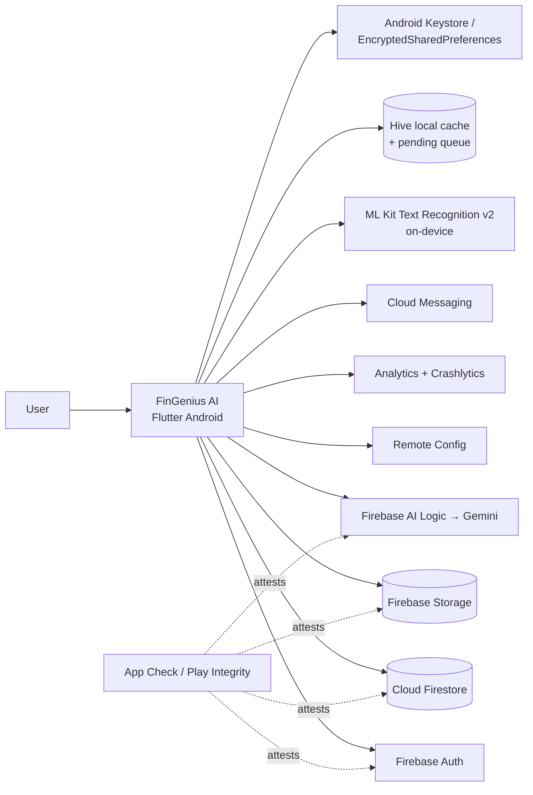
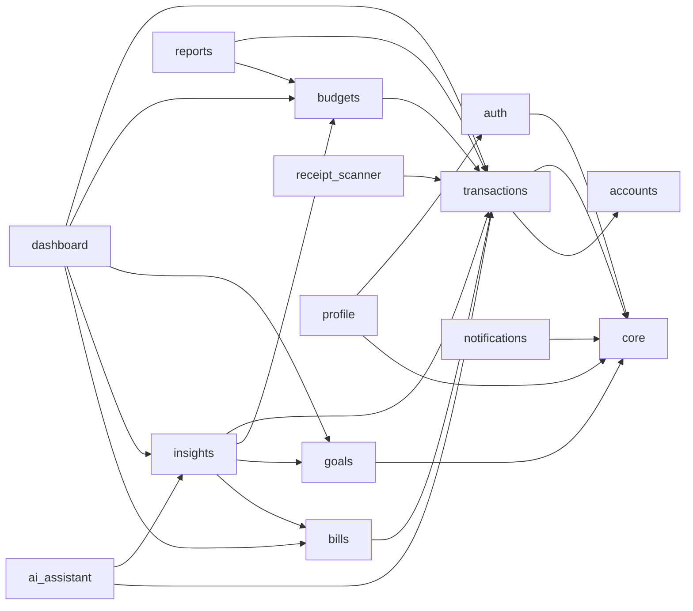
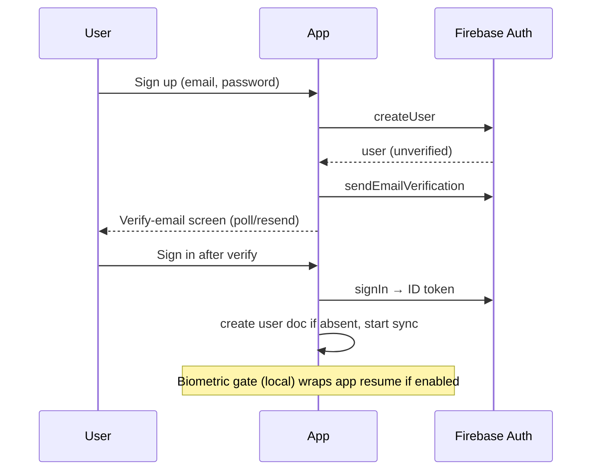
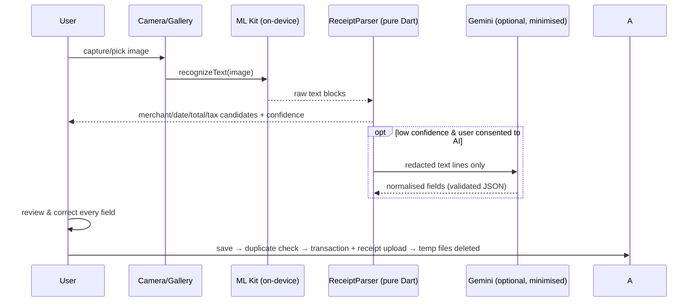
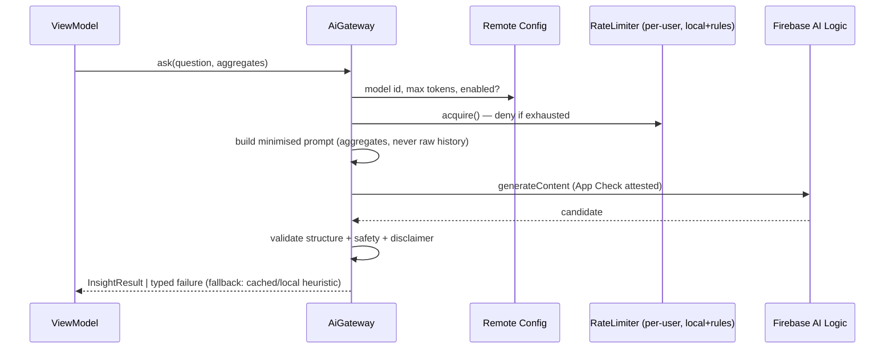
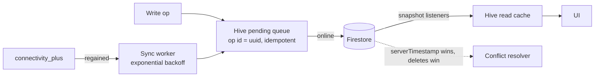
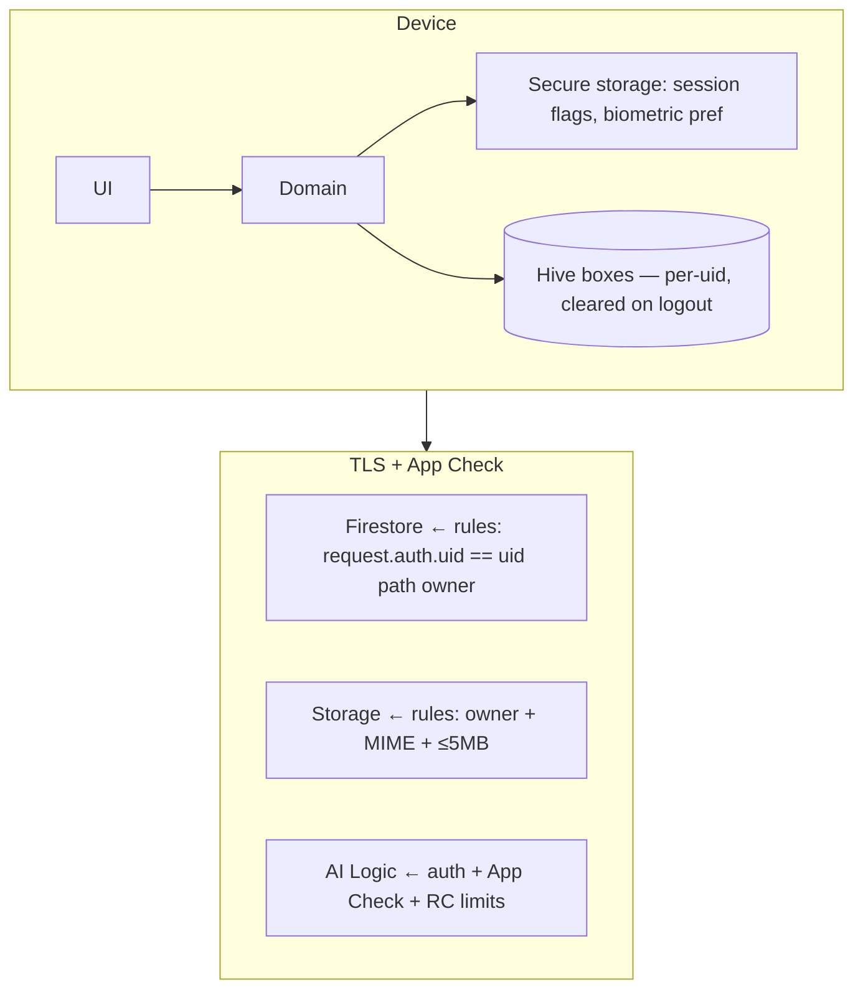

# FinGenius AI — Architecture

Clean Architecture + feature-first + MVVM. Domain layers are pure Dart (testable without Flutter). Data layers implement domain repository interfaces against Firebase/Hive. Presentation uses Riverpod `Notifier`s as ViewModels.

## System context



## Container / component view

```mermaid
flowchart TB
  subgraph Presentation
    UI[Screens + Widgets] --> VM[Riverpod Notifiers / ViewModels]
  end
  subgraph Domain
    VM --> UC[Use-cases & domain services\nhealth score, forecast, duplicates,\nsubscriptions, categoriser, OCR parser]
    UC --> RI[Repository interfaces]
    ENT[Entities: Money, Transaction, Account,\nBudget, Goal, Bill, Receipt, Insight]
  end
  subgraph Data
    RI --> RIMPL[Repository implementations]
    RIMPL --> FSD[Firestore DataSource]
    RIMPL --> LCD[Hive local cache]
    RIMPL --> Q[Pending-op queue]
    RIMPL --> STD[Storage DataSource]
    RIMPL --> AID[AI service (Firebase AI Logic)]
  end
```

## Feature dependency rules


Features never import other features' data layers — only domain entities/providers. `core` imports nothing from features.

## Authentication flow



## Receipt OCR flow



## AI request flow



## Offline synchronisation



## Notification flow

FCM token registered post-consent → stored at `users/{uid}/devices/{token}`. Local scheduled notifications for bill reminders/nudges respect quiet hours (default 22:00–07:30, user-configurable). Notification centre persists in-app notifications at `users/{uid}/notifications`.

## Firestore data model (summary — full schema in `docs/firestore_data_model.md`)

```
users/{uid}                        profile, prefs, consent, schemaVersion
  accounts/{id}                    name, type, balanceMinor, currency
  transactions/{id}                type, amountMinor, categoryId, date, accountId, receiptId?, pending flags
  categories/{id}                  seeded + custom, icon, colorKey
  budgets/{id}                     categoryId, periodKey(YYYY-MM), limitMinor
  goals/{id}                       target, deadline, contributions[]
  bills/{id}                       recurrence rule, nextDue, autoDetected?
  subscriptions/{id}               merchant, interval, confidence, status
  notifications/{id}               type, title, body, read
  receipts/{id}                    storagePath, ocr fields, confidence
  ai_conversations/{id}/messages   role, content, createdAt
  insights/{id}                    type, payload, period
  reports/{YYYY-MM}                monthly AI summary + aggregates
  health_history/{YYYY-MM}         score + factor breakdown
  feedback/{id}                    categorisation corrections (learning source)
```

## Security boundaries



## Key patterns

Repository (domain interface / Firebase impl), MVVM (Riverpod Notifier), Strategy (categorisation pipeline stages), Command queue (offline ops), Result type (`Result<T>` sealed) for typed errors, DI via Riverpod providers, immutable entities (freezed-style manual immutability without codegen).
